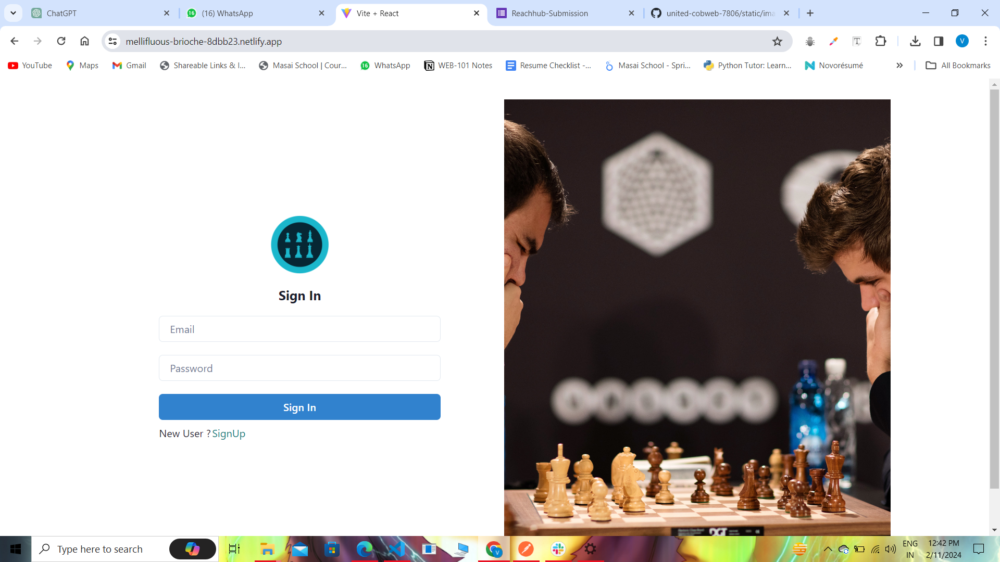
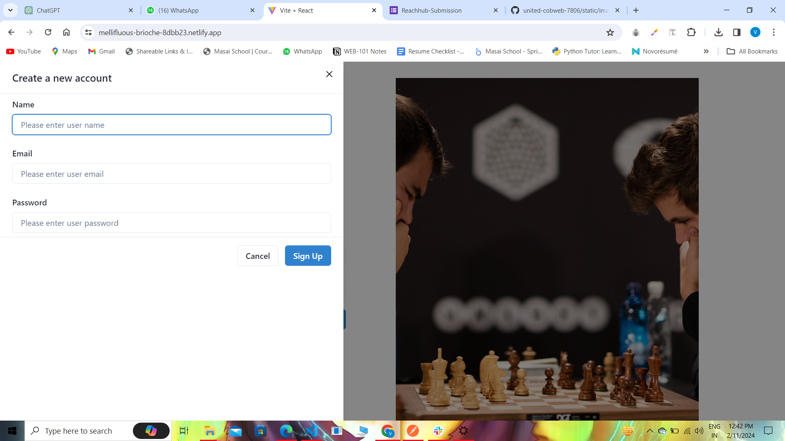
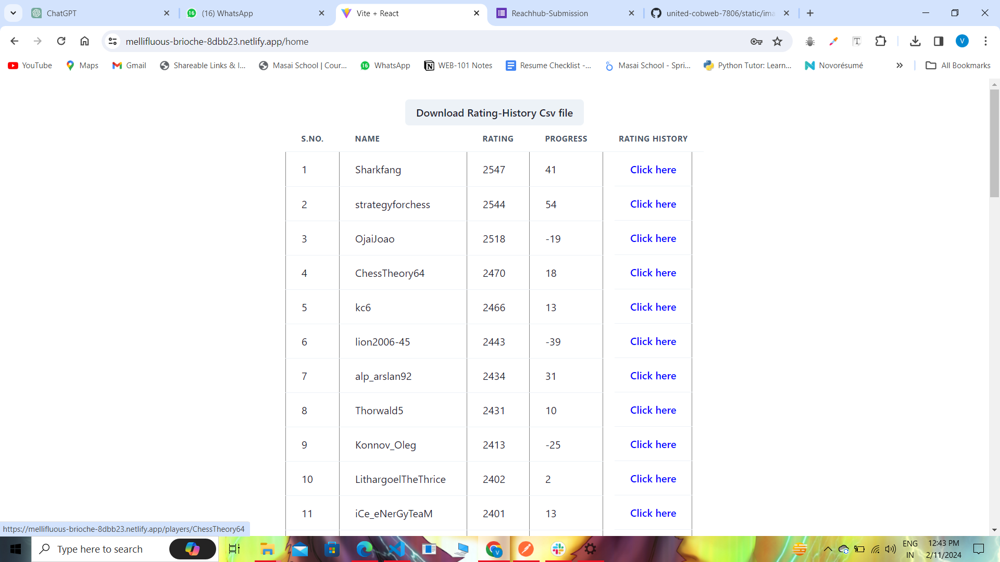
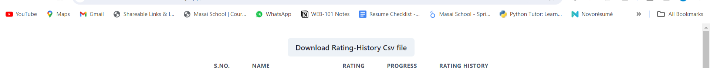
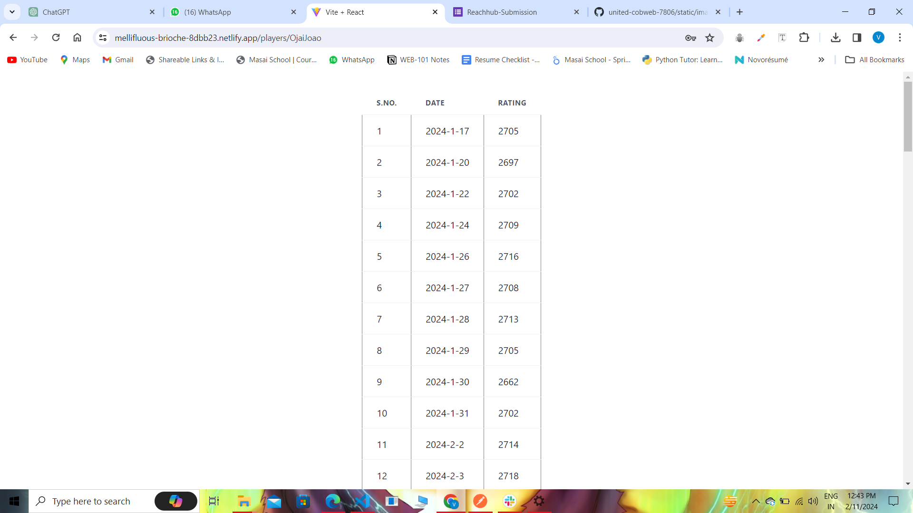

# Technology Stack Used

In this project we have used the following tech stack.

- HTML
- CSS
- JAVASCRIPT
- ReactJS

- EXPRESS
- NODEJS
- MONGODB - Atlas

To make this clone we have used HTMl, CSS and JavaScript for front-end and NodeJS, ExpressJs and MongoDB for back-end.

# Snapshots of Our Project 📸

## Landing Page

## SignUp Page

You can signup with our website from here .

## Login Page

You can login to our website from here by entering required details.

## Top 50 players Page

Here, you can see top 50 chess players

## Csv Button

Here, you can download  a CSV file with the rating history for the top 50 players. Each row contains the player’s username, their rating from 30 days ago, and their rating for each subsequent day up to today..

## Rating Points

Here, you can see all of rating of single player for last 30 days.

